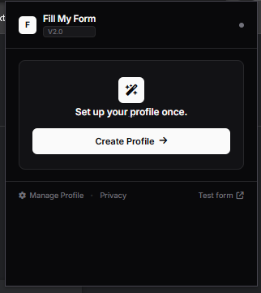
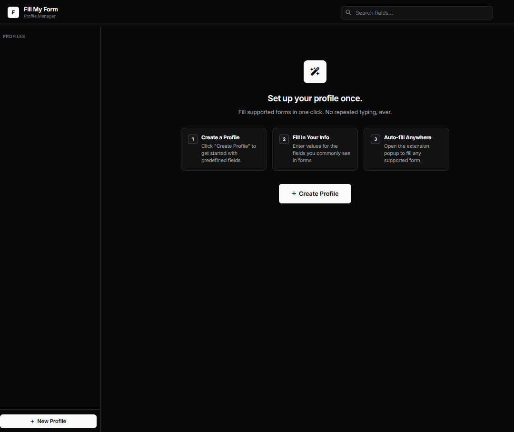
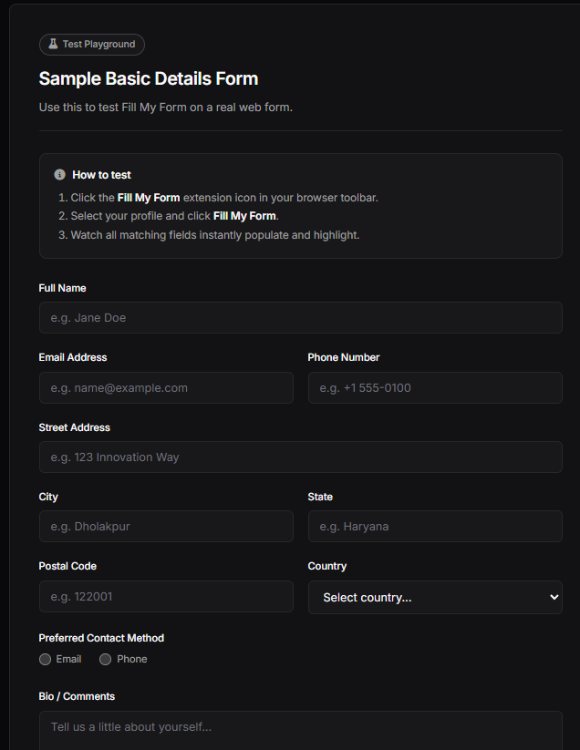
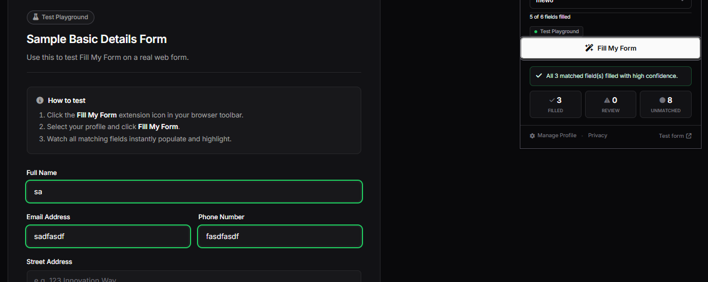

<h1 align="center">FillMyForm</h1>

<p align = "center">
  
  
  
  
  
  
</p>

FillMyForm is a browser extension that keeps your details in profiles and fills long, tedious forms in one click. Set up a profile once, pick it from the extension popup, and the form fills itself. Everything is stored locally in your browser.

**New: FillMyForm now works on Google Forms, Tally and Fillout, not just standard HTML forms.**

## Live Demo Video

Demo: [Here](https://drive.google.com/file/d/1s8X8mNem5TYBNx56bBD2sSksYEtp4Z2g/view?usp=sharing)

V2 Demo: [Here](https://drive.google.com/file/d/1wlo_Pd4ZcQPvgkOKoxZzyQfbON7zVGQQ/view?usp=sharing)


## Screenshots
 
<p align="center">
  
  
</p>
<p align="center">
  
  
</p>

## What's New
 
- **Google Forms, Tally and Fillout support.** The biggest update so far. FillMyForm can now read the questions on these form builders and fill your answers, in addition to regular HTML forms.
- **Default fields on every new profile.** You no longer have to build your profile from scratch. Creating a profile now generates a ready-made set of fields (identity, contact, address, education and professional details), so you only need to type in the values.
- **Better confidence checking.** Matching between page labels and your profile fields is more reliable, and the highlight colors tell you how much to trust each filled field.

## Features
- **One click filling** fills every field it recognizes on the page
- **Works on form builders** with support for Google Forms, Tally and Fillout
- **Default profile fields** so a new profile starts with the details forms ask for most
- **Multiple profiles** so you can keep work and personal details separate
- **Local storage only** as your data never leaves your browser
- **Custom fields** let you add anything the default fields do not cover
- **Alternate values** for fields like a second email or phone number, with a small picker on the page to switch between them
- **Match highlighting** shows a green outline for exact matches and a yellow outline for close matches worth a second look
- **Import and export** to back up a profile as a JSON file or move it to another browser
- **Never submits** as the extension only fills fields, and you review the form yourself


## Supported Forms
 
| Form type | Status |
| --- | --- |
| Standard HTML forms | Supported |
| Google Forms | Supported |
| Tally | Supported |
| Fillout | Supported |

## Tech Stack

- **Language:** TypeScript
- **Bundler:** Vite
- **Platform:** Chrome extension (Manifest V3), popup, options page and content script
- **Storage:** `chrome.storage.local`
- **Frontend:** HTML and CSS
- **Icons:** Font Awesome

## What is does 

You create a profile and fill in the detials you type most often: name, email, phone, adress, date of birth and anything else you add. When you open a form. choose a profile in the popup and click Fill my form. The extension reads the label on the page, matches them to your profile fields and fills the ones it recognizes.

V1 supports standard HTML form fields. Google Forms, Tally, Fillout and other form buildres are planned for later versions.


## How to use it

1. Open Manage Profiles from the popup and create a profile.
2. Fill in your details and click Save profile.
3. Open a page with a form, or use the sample form from the popup.
4. Select the profile in the popup and click Fill my form.
5. Review the filled fileds before you submit.

## Running it on yo pc

Clone the repo: 

```
git clone https://github.com/raze-me/fillmyform
cd fillmyform
```

Install the dependencies:

```
npm install
```

Build the extension:

```
npm run build
```

The production extension is generated in the `dist/` folder.

Load it in Chrome:

1. Open `chrome://extensions`
2. Turn on Developer Mode
3. Click load unpacked button
4. select the `dist` folder


## Project structure
 
```
manifest.json               Extension manifest
vite.config.ts              Vite build for popup, options and background
vite.content.config.ts      Vite build for the content script
tsconfig.json               TypeScript configuration
images/                     Screenshots used in this README
public/
    test-form.html          Sample form for testing
    privacy.html            Privacy page linked from the options page
src/
    adapters/
        googleForms.ts      Detects and fills Google Forms
        tally.ts            Detects and fills Tally forms
        fillout.ts          Detects and fills Fillout forms
    background/
        background.ts       Background script
    content/
        content.ts          Runs on the page and fills the form
    lib/
        extractor.ts        Finds form fields and works out their labels
        matcher.ts          Matches page labels to profile fields
        matcher.test.ts     Tests for the matcher
        filler.ts           Writes values, highlights fields and adds the value picker
        defaults.ts         Default fields created with every new profile
        schema.ts           Profile and field types
        storage.ts          Reads and writes profiles in chrome.storage.local
    options/
        options.html        Profile manager page
        options.ts          Profile editing, import and export
    popup/
        popup.html          Extension popup
        popup.ts            Profile selection and the fill button
```


## How matching works

The content script first checks which kind of form it is on: Google Forms, Tally, Fillout, or a standard HTML form. Each adapter in `src/adapters/` knows how to find the questions and fill the answers for its builder. Standard forms use the extractor in `src/lib/extractor.ts`.
 
For standard forms, the extractor collects every input, select and textarea on the page and works out a label for each one. It checks in order: the linked `<label>`, a wrapping label, `aria-labelledby`, nearby text, the placeholder, and finally the field's `name` or `id`.
 
Each label is then matched to a profile field. If the input has an `autocomplete` attribute, that is used first and counts as an exact match. Otherwise the label is cleaned up and compared against each profile field's name and synonyms.
 
The result is scored with a confidence check:
 
- **Exact match:** the label is identical to a profile field or synonym. The field is filled and outlined in green.
- **Close match:** there is no identical match, but the closest one is similar enough. The field is filled and outlined in yellow so you know to check it.
- **No match:** the field is left empty.
When a field has more than one saved value, the first is filled, the field is marked for review, and a small picker lets you switch.
 

**All data is saved locally and nothing is being saved outside the user's browser**

## Testing 

1. Create a profile.
2. Open the sample tes form from the popup.
3. select the profile in the extension 
4. click fill my form.
5. Review the populated fields.


## Requirements
 
Node.js 20.19 or later and a Chromium based browser.
 
## License
 
MIT
 
## Authors
 
Built by
- [@raze-me](https://github.com/raze-me)
- [@rexaintreal](https://github.com/rexaintreal)
